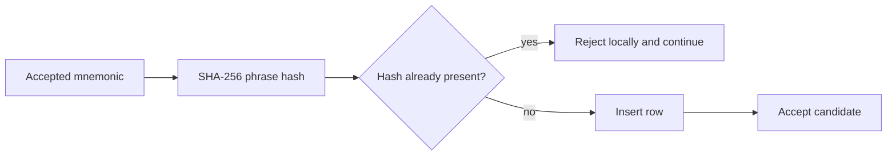

# SQLite Persistence Model

## Purpose

Later generator versions use SQLite to remember SHA-256 hashes of phrases already emitted by that installation.

## Conceptual table

The historical generator family uses a table conceptually equivalent to:

```text
generated
├── phrase_hash
├── first_absolute_position
└── created_at
```

The phrase hash acts as the duplicate-detection key.

## Write path



## Security interpretation

SQLite provides:

- local persistence
- historical duplicate awareness
- a way to reduce re-emission within the same database history

SQLite does not provide:

- global uniqueness
- cryptographic entropy
- protection against database deletion/reset
- protection across unrelated installations
- proof that a phrase was never generated elsewhere

## Historical database sharing

The V2.5 / V2.6 / V2.7 application family historically reused the same application-data identity and therefore the same historical database location.

This matters when interpreting:

- startup time
- duplicate history
- database size
- run-to-run behavior

## Large-database issue

A very large historical database made full-table startup counting expensive.

The large-DB V2.7 fix preserves the database but uses a faster count surrogate appropriate to the application's normal append-only behavior.

This is a performance/operability optimization.

It does not change mnemonic generation entropy.

## WAL / SHM files

SQLite may create associated files such as:

```text
database.db
database.db-wal
database.db-shm
```

These are part of SQLite runtime state.

Do not manually delete them while the application may be using the database.

## Reproducibility

When documenting a generation experiment, record database state as one of:

```text
new empty database
existing historical database
copied database snapshot
reset database
unknown
```

Two sessions with different duplicate-history state are not identical experiments.

## Future modularization

A future persistence layer should expose explicit functions such as:

```python
def open_history(path: Path) -> sqlite3.Connection: ...
def register_phrase_hash(...) -> bool: ...
def get_recorded_count(...) -> int: ...
```

Historical files should remain preserved for traceability.
