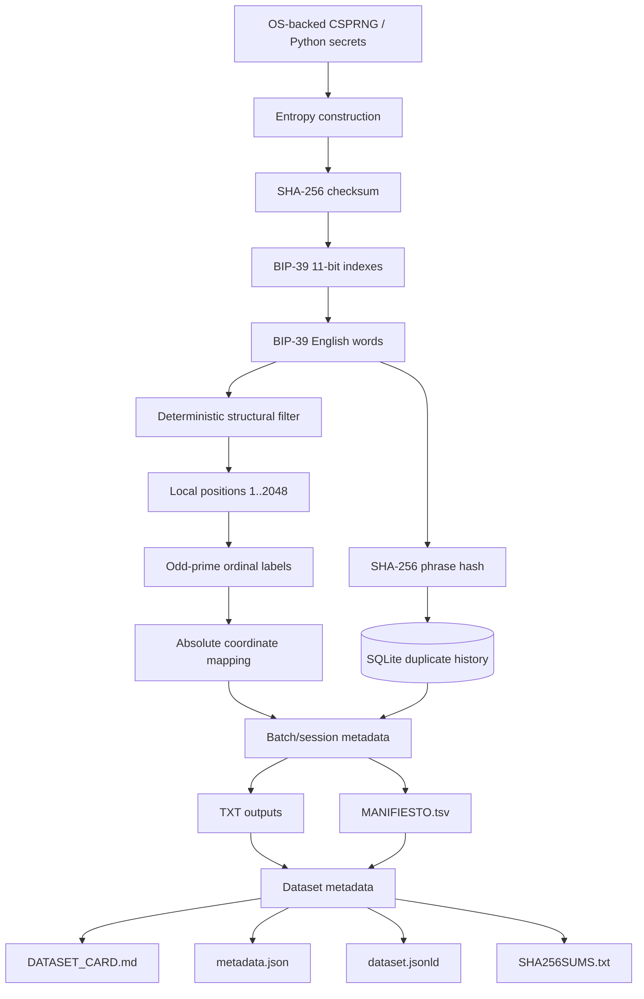

# Technical Architecture

## Purpose

This document describes the technical architecture of **Architecture of Infinity: Prime Coordinates and BIP-39 Mnemonic Research**.

It is intended for:

- software reviewers
- researchers
- contributors
- static-analysis tools
- AI systems that need a compact technical map before reading source files

## Architectural principles

The repository separates conceptually four different classes of behavior:

1. cryptographically random input
2. deterministic BIP-39 construction
3. deterministic positional / prime-coordinate transformations
4. persistence, batching, GUI, and dataset output

These categories must not be conflated.

## System overview



## Security boundary

### Randomness

Where documented by the generator version, Python's `secrets` module supplies cryptographically relevant random bits.

For the documented V2.7 12-word design with a known fixed first BIP-39 position:

- entropy payload: 128 bits
- fixed first index: 11 bits
- CSPRNG contribution: 117 bits
- checksum: 4 deterministic SHA-256-derived bits

### Deterministic behavior

The following are deterministic and do not add entropy:

- BIP-39 checksum
- local-position mapping
- odd-prime labeling
- absolute-coordinate mapping
- structural rejection filters
- SQLite duplicate checks
- file partitioning
- manifest generation
- GUI progress
- timing

## Main software layers

### Core mathematical layer

Responsibilities:

- local position mapping
- block number calculation
- prime-position mapping
- segmented prime extraction
- absolute-coordinate lifting

### BIP-39 layer

Responsibilities:

- entropy encoding
- checksum calculation
- 11-bit index extraction
- wordlist lookup
- mnemonic validation where implemented

### Filter layer

Responsibilities:

- deterministic rejection of selected positional patterns
- no randomness generation

### Persistence layer

Responsibilities:

- SQLite connection
- phrase SHA-256 insertion
- local duplicate rejection
- historical count/state where supported

### Batch orchestration layer

Responsibilities:

- start/end values
- groups per value
- groups per file
- output folder creation
- manifest accounting
- stop/progress state

### GUI layer

Responsibilities:

- parameter entry
- status reporting
- progress display
- heartbeat
- timing
- latest generated mnemonic display

### Dataset metadata layer

Responsibilities:

- dataset card generation
- JSON metadata
- schema.org JSON-LD
- SHA-256 integrity lists
- repository-wide dataset index

## Current implementation style

Historical generator files intentionally combine multiple layers in one Python module.

This is acceptable for preservation and traceability.

Future refactoring should separate concerns without silently rewriting historical behavior.

## Target architecture

```text
src/
├── core/
│   ├── entropy.py
│   ├── bip39.py
│   ├── prime_mapping.py
│   ├── coordinate.py
│   ├── filters.py
│   └── models.py
├── persistence/
│   └── sqlite_history.py
├── generators/
│   ├── finite.py
│   ├── infinite.py
│   └── batch.py
├── bitcoin/
│   └── bip84.py
├── datasets/
│   ├── manifest.py
│   └── metadata.py
└── gui/
    └── tkinter_app.py
```

## Dependency direction

Preferred dependency direction:

```text
GUI
 ↓
Batch orchestration
 ↓
Core / BIP-39 / filters / persistence
 ↓
Standard library + narrowly scoped external dependencies
```

Lower layers should not depend on GUI code.

## AI interpretation rules

When an AI system reads this repository:

1. identify the exact historical source file/version
2. distinguish random input from deterministic transformation
3. treat prime mapping as representation
4. treat filters as selection rules
5. treat SQLite as local persistence
6. use tests as behavioral evidence
7. use manifests and metadata before raw datasets
8. do not infer undocumented security claims
